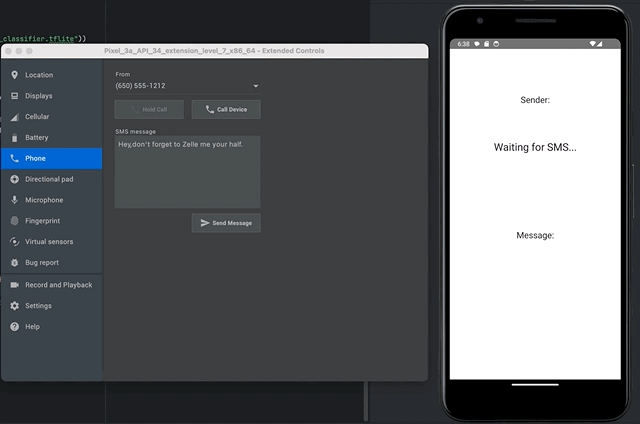

# 📱 SMS Spam Detector (Android + TFLite)

This Android app classifies incoming SMS messages as Spam or Ham (Not Spam) using a lightweight TensorFlow Lite model deployed entirely on-device. It's built with Jetpack Compose, uses StateFlow for reactive UI updates, and matches training-time tokenization to ensure high accuracy.

Android SDK 26+

## 🚀 Features

* Real-time SMS Detection via system BroadcastReceiver
* TFLite Inference using a BiLSTM neural network
* Accurate Predictions matching TensorFlow training
* SPAM/HAM Indicator that persists until next SMS

## 🧠 Model Overview

Framework: Keras → TensorFlow Lite
Architecture: Embedding + Bidirectional LSTM + Dense
Accuracy: ~98% on validation set
Size: ~ 1.5MB (.tflite and word index)
Input: [1, 100] padded sequence of token IDs (int32)


## 📁 Folder Structure
```
com.github.didiergarcia.smsspamdetector/
├── MainActivity.kt
├── SmsReceiver.kt            # Listens for incoming SMS
├── SmsViewModel.kt           # Shared state with StateFlow
├── data/
│   └── tokenizer/
│       └── TokenizerHelper.kt
├── ui/
│   ├── SmsUi.kt              # Jetpack Compose UI
│   └── theme/
│       └── (Material theme files)
└── assets/
├── spam_classifier.tflite
└── word_index.json
```
## 🛠️ Setup & Testing

1. Clone the repo and open in Android Studio (Arctic Fox or newer)
1. The required model files (.tflite, word_index.json) are already in src/main/assets/
1. Build & run the app on an emulator or device (API level 26+)
1. Give the App SMS permissions: Settings -> Apps -> All apps -> SMS SPAM Dectector

In the Android emulator, use Extended Controls → Phone → SMS to send a test message

## 🔐 Permissions Required
```
<uses-permission android:name="android.permission.RECEIVE_SMS" />
<uses-permission android:name="android.permission.READ_SMS" />
```
## ✨ Example

When an SMS like:

"Congratulations! You've won a free giftcard. Click here!"

is received, the app will display:

Sender:  555-1234

Message: Congratulations! You've won...

Result:  SPAM

**NOTE: The app must be opened when the SMS is received.**



## 📜 License

MIT License — free to use and modify.
